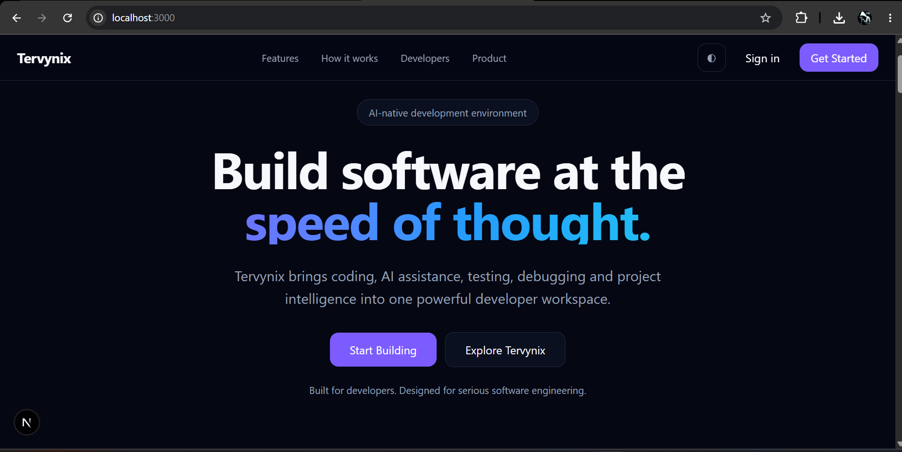
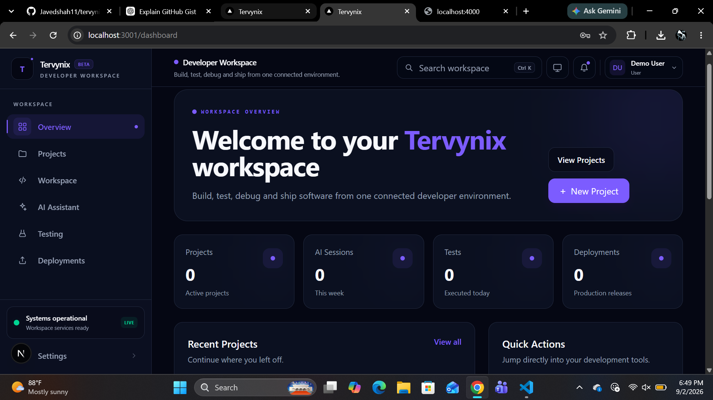

# Tervynix

<p align="center">
  <strong>A modern developer workspace for coding, terminals, runtime management, AI-assisted development, and deployment.</strong>
</p>

<p align="center">
  <strong>Code • Run • Debug • Manage • Collaborate • Deploy</strong>
</p>

<p align="center">
  
  
  
</p>

---

## What is Tervynix?

**Tervynix** is an actively developed developer platform designed to bring the most important parts of software development into one connected workspace.

The goal is to reduce context switching between editors, terminals, process managers, runtime tools, infrastructure dashboards, AI assistants, and deployment systems.

Tervynix is being designed around one workflow:

```text
Code
  ↓
Run
  ↓
Debug
  ↓
Manage
  ↓
Collaborate
  ↓
Deploy
```

This repository is the **public development hub for Tervynix**.

It contains product previews, architecture documentation, engineering progress, roadmap information, development milestones, contribution guidance, and public project discussions.

> Tervynix is under active development. Features marked as planned are architectural or product goals and should not be considered production-complete.

---

## Product Preview

### Landing Experience



A developer-first product experience focused on modern software engineering workflows.

---

### Developer Dashboard



The dashboard provides a central place for projects, workspace activity, runtime state, developer actions, and future platform capabilities.

---

### Project Management


Create and manage development projects while keeping project configuration and runtime context connected.

---

### Create Project


Structured project creation supports development modes, frameworks, languages, visibility, and workspace configuration.

---

## Current Capabilities

### Developer Workspace

- Monaco-powered code editor
- Project workspaces
- Multi-file tab management
- Autosave
- Manual save
- Workspace persistence
- Keyboard-driven workflows

### Terminal

- Integrated terminal
- Multiple terminal sessions
- Terminal session management
- Terminal reattachment
- Shell process tracking

### Runtime Management

- Process management
- Process start / stop / restart
- Port management
- Task discovery
- Task execution
- Runtime monitoring
- Runtime events
- Runtime history
- Preview / open-port workflows
- Realtime runtime communication

### Authentication & Projects

- Authentication
- Login / logout
- Authenticated project access
- Project ownership protection

---

## Current Engineering Status

| Area | Status |
|---|---|
| Developer workspace | ✅ Implemented |
| Authentication | ✅ Implemented |
| Project ownership | ✅ Implemented |
| Integrated terminal | ✅ Implemented / hardening |
| Process management | ✅ Implemented |
| Port management | ✅ Implemented |
| Task execution | ✅ Implemented |
| Runtime monitoring | ✅ Implemented |
| Runtime history | ✅ Implemented |
| Runtime History PostgreSQL migration | ✅ Current scope complete |
| WebSocket runtime communication | ✅ Foundation implemented |
| PostgreSQL migration | 🟡 In progress |
| Drizzle ORM integration | 🟡 In progress |
| NestJS backend migration | 🟡 In progress |
| Fastify integration | 🟡 In progress |
| Windows PTY / ConPTY reliability | 🧪 Hardening |
| Redis | ⚪ Planned |
| BullMQ | ⚪ Planned |
| Rust runtime agent | ⚪ Planned |
| Workspace-aware AI | ⚪ Planned |
| Cloud workspaces | ⚪ Planned |
| Deployment platform | ⚪ Planned |
| Collaboration | ⚪ Planned |

For detailed engineering status, see:

**[Development Status →](./docs/DEVELOPMENT_STATUS.md)**

---

## Latest Engineering Milestone

### Runtime History — PostgreSQL & Recovery Safety

The latest completed scoped milestone focused on migrating and hardening Runtime History behavior against PostgreSQL.

Validated behavior:

- ✅ History ordering
- ✅ Pagination
- ✅ Retention
- ✅ Duplicate protection
- ✅ Recovery scoping

Validation results:

```text
22 focused tests passed
8 real PostgreSQL tests passed
Targeted TypeScript typecheck passed
Targeted lint passed
```

Runtime recovery was also made deliberately safer.

Application startup no longer automatically marks historical runtime executions as interrupted.

Recovery now requires explicitly confirmed stopped execution identities before modifying runtime-history state.

**Current blocker for this scoped work: None.**

See the full history in **[CHANGELOG.md](./CHANGELOG.md)**.

---

## Architecture

Tervynix is evolving toward a modular architecture designed for runtime reliability, scalability, maintainability, and future cloud execution.

```text
                         TERVYNIX
                            │
             ┌──────────────┴──────────────┐
             │                             │
       Web Application                Backend/API
     React + Next.js                NestJS + Fastify
             │                             │
             │                    Domain / Application
             │                         Services
             │                             │
     Developer Workspace        ┌──────────┼──────────┐
             │                  │          │          │
    ┌────────┼────────┐     PostgreSQL   Redis     BullMQ
    │        │        │      + Drizzle  (Planned)  (Planned)
 Monaco   Terminal   Runtime
 Editor    xterm     Controls
                      │
                 Runtime Layer
                      │
              Rust Runtime Agent
                   (Planned)
```

The migration is intentionally incremental.

Tervynix follows several important engineering principles:

- Migrate instead of unnecessarily rewriting working systems
- Keep the application operational after migration phases
- Separate application logic from infrastructure
- Introduce repository and runtime contracts
- Validate migrated behavior with focused testing
- Remove legacy implementations only after replacements are verified
- Keep planned architecture clearly separated from implemented functionality

Read the complete architecture document:

**[Architecture →](./docs/ARCHITECTURE.md)**

---

## Technology Direction

### Application

- TypeScript
- React
- Next.js
- Monaco Editor
- xterm.js

### Backend

- NestJS
- Fastify
- Domain-oriented services
- Repository abstractions
- Infrastructure adapters

### Persistence

- PostgreSQL
- Drizzle ORM
- MongoDB during migration

### Realtime

- WebSockets
- Redis — planned
- Distributed runtime synchronization — planned

### Background Infrastructure

- BullMQ — planned

### Runtime

- Current Node.js / PTY runtime infrastructure
- Rust runtime agent — planned

### Observability

- Structured logging
- Runtime metrics
- OpenTelemetry — planned

---

## Runtime Vision

Runtime management is one of the core engineering areas of Tervynix.

The long-term runtime system is intended to support:

- Process lifecycle management
- Process-tree discovery
- Terminal sessions
- Signal handling
- Port discovery
- Runtime events
- Runtime history
- File-system monitoring
- Resource monitoring
- Runtime metrics

A dedicated **Rust runtime agent** is planned for performance-sensitive and operating-system-level operations.

---

## AI Vision

Tervynix AI is intended to work with the developer's actual workspace rather than operate as a disconnected chat interface.

Planned capabilities include:

- Repository-aware assistance
- Workspace context
- Multi-file code understanding
- Code generation
- Code explanation
- Refactoring
- Debugging assistance
- Runtime-aware debugging
- Architecture assistance
- Code review
- Documentation generation
- Automated development workflows

AI capabilities remain part of the planned platform direction and are not presented here as production-complete.

---

## Cloud & Deployment Vision

Future Tervynix development is intended to support:

- Cloud development workspaces
- Persistent remote environments
- Remote runtime execution
- Workspace synchronization
- Resume and reconnect workflows
- Project deployment
- Environment management
- Deployment logs
- Domain integration
- Deployment monitoring

---

## Public Documentation

| Document | Purpose |
|---|---|
| [Vision](./VISION.md) | Long-term product direction |
| [Roadmap](./ROADMAP.md) | Completed, in-progress, and planned work |
| [Architecture](./docs/ARCHITECTURE.md) | Technical architecture and migration direction |
| [Development Status](./docs/DEVELOPMENT_STATUS.md) | Detailed engineering status |
| [Changelog](./CHANGELOG.md) | Major development milestones |
| [Contributing](./CONTRIBUTING.md) | Contribution guidelines |
| [Security](./SECURITY.md) | Security reporting policy |
| [Support](./SUPPORT.md) | Project support guidance |
| [Code of Conduct](./CODE_OF_CONDUCT.md) | Community standards |
| [License](./LICENSE) | Usage and licensing terms |

---

## Roadmap

Tervynix development is progressing through several major areas:

**Current**

- PostgreSQL migration
- Backend modernization
- Repository boundaries
- NestJS / Fastify integration
- Runtime reliability
- PTY lifecycle hardening
- Integration and acceptance testing

**Next**

- Distributed realtime infrastructure
- Redis
- BullMQ
- Runtime abstraction improvements
- Rust runtime agent

**Long Term**

- Workspace-aware AI
- Cloud development environments
- Deployment infrastructure
- Collaboration
- Developer APIs
- Extension ecosystem
- Observability
- Advanced security

See the full **[Tervynix Roadmap](./ROADMAP.md)**.

---

## Building in Public

Tervynix is being developed publicly at the product and engineering-progress level.

This repository will continue to share:

- Product previews
- Architecture decisions
- Engineering milestones
- Runtime work
- Migration progress
- Testing milestones
- Roadmap updates
- Technical documentation
- Feature discussions

Development updates may change as implementation, testing, and real-world constraints reveal better technical approaches.

---

## Contributing

Feedback, technical discussion, bug reports, and feature proposals are welcome.

Before contributing, please read:

- [CONTRIBUTING.md](./CONTRIBUTING.md)
- [CODE_OF_CONDUCT.md](./CODE_OF_CONDUCT.md)
- [SECURITY.md](./SECURITY.md)
- [LICENSE](./LICENSE)

### Reporting Bugs

Use the GitHub **Bug Report** issue template and include:

- Environment information
- Steps to reproduce
- Expected behavior
- Actual behavior
- Relevant logs
- Screenshots where useful

Never publish credentials, API keys, tokens, database passwords, or private project information.

### Feature Requests

Use the **Feature Request** template to propose improvements or new capabilities.

Strong proposals explain the developer problem first, then the proposed solution.

---

## Security

Security issues should be reported responsibly.

Please do not publicly disclose active vulnerabilities, credentials, private tokens, or detailed exploit instructions before maintainers have had an opportunity to investigate.

Read **[SECURITY.md](./SECURITY.md)** for the reporting process.

---

## License

Tervynix is currently distributed under the terms described in **[LICENSE](./LICENSE)**.

The public availability of this repository does not automatically grant unrestricted rights to copy, redistribute, commercially reuse, or rebrand Tervynix materials.

Third-party dependencies remain subject to their respective licenses.

---

## Follow the Project

If you are interested in:

- Developer tooling
- Runtime systems
- TypeScript
- Next.js
- NestJS
- PostgreSQL
- Rust
- AI developer tools
- Cloud development environments

you can follow the repository as Tervynix evolves.

If the project interests you:

**Star the repository and follow its development.**

---

<p align="center">
  <strong>Build with Tervynix.</strong>
</p>
