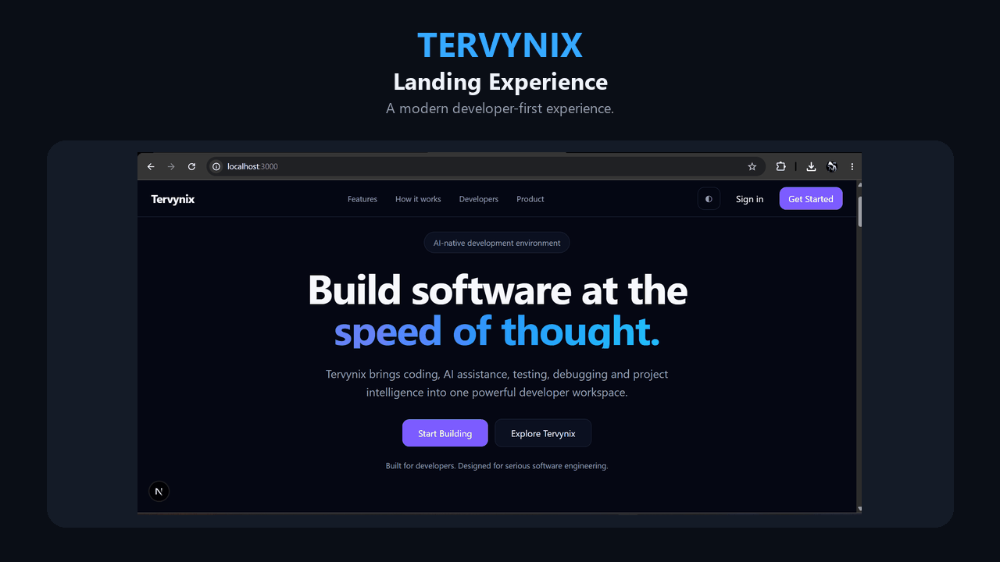
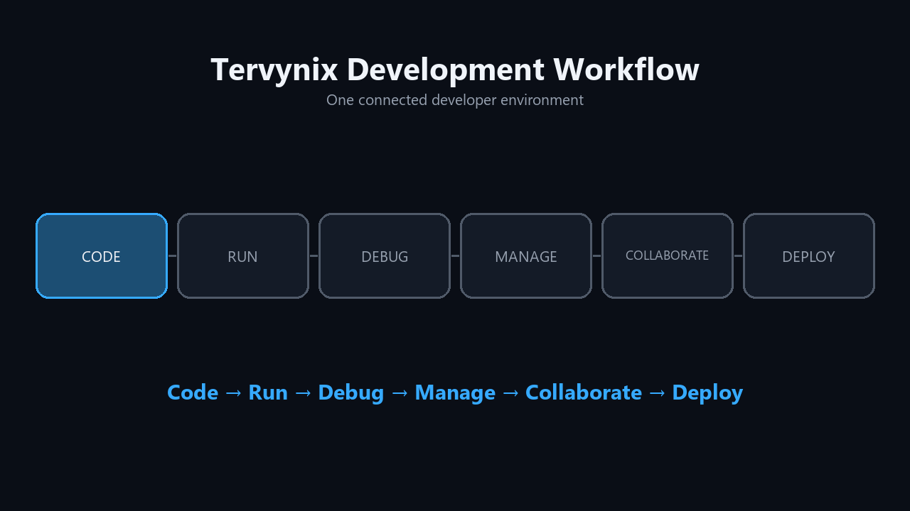
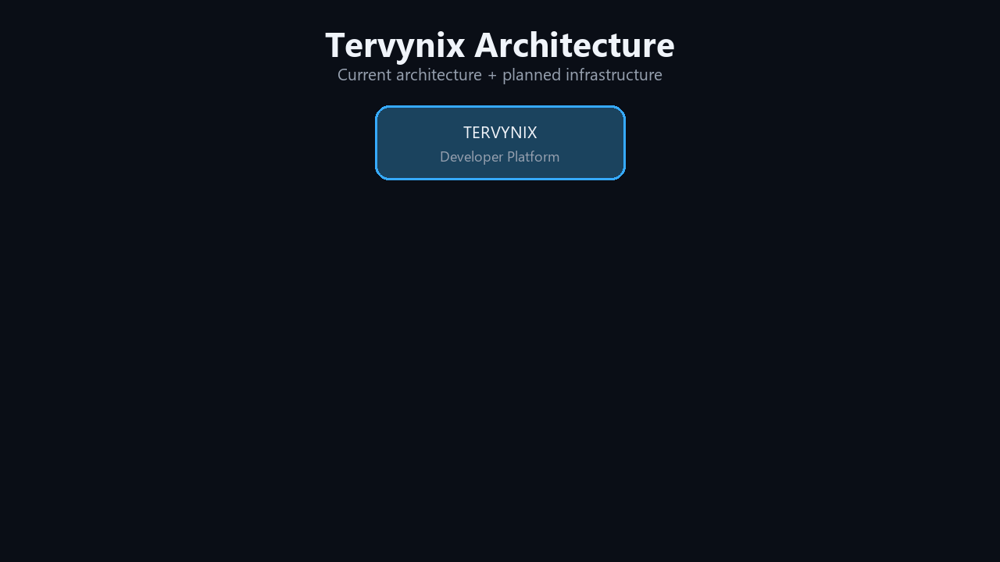

<div align="center">

# Tervynix

### Modern Developer Workspace


<br />


<br />


<br /><br />

<strong>Code • Run • Debug • Manage • Collaborate • Deploy</strong>

<br /><br />

<a href="#product-demo">Product Demo</a> •
<a href="#current-capabilities">Capabilities</a> •
<a href="#engineering-status">Status</a> •
<a href="#architecture">Architecture</a> •
<a href="#roadmap">Roadmap</a> •
<a href="#documentation">Documentation</a>

</div>

---

## What is Tervynix?

**Tervynix** is an actively developed developer platform designed to bring the most important parts of software development into one connected workspace.

Modern development often means switching between an editor, terminal, process manager, port inspector, runtime tools, infrastructure dashboards, AI assistants, and deployment systems. Tervynix is being built to reduce that fragmentation and make the development lifecycle feel like one connected environment.

<div align="center">

### Code → Run → Debug → Manage → Collaborate → Deploy

</div>

This repository is the **public development hub for Tervynix**. It contains product previews, architecture documentation, engineering progress, milestones, roadmap information, contribution guidance, and public project discussions.

> **Development note**
>
> Tervynix is under active development. Implemented, in-progress, and planned capabilities are intentionally separated throughout this repository so future architecture is not presented as production-complete functionality.

---

## Product Demo

<div align="center">



</div>

The animated preview currently cycles through the public product experience:

**Landing → Dashboard → Projects → Project Creation**

### Development Workflow

<div align="center">



<br />

<strong>Code → Run → Debug → Manage → Collaborate → Deploy</strong>

</div>

<details>
<summary><strong>View product screenshots</strong></summary>

<br />

### Landing Experience


A developer-first product experience focused on modern software engineering workflows.

### Developer Dashboard


A central place for projects, workspace activity, runtime state, developer actions, and future platform capabilities.

### Project Management


Manage development projects while keeping project configuration and runtime context connected.

### Create Project


Structured project creation with development modes, frameworks, languages, visibility, and workspace configuration.

</details>

---

## Current Capabilities

<table>
<tr>
<td width="50%" valign="top">

### Developer Workspace

- ✅ Monaco-powered code editor
- ✅ Project workspaces
- ✅ Multi-file tab management
- ✅ Autosave
- ✅ Manual save
- ✅ Workspace persistence
- ✅ Keyboard-driven workflows

</td>
<td width="50%" valign="top">

### Integrated Terminal

- ✅ Integrated terminal
- ✅ Multiple terminal sessions
- ✅ Session management
- ✅ Terminal reattachment
- ✅ Shell process tracking
- 🧪 PTY / ConPTY hardening

</td>
</tr>

<tr>
<td width="50%" valign="top">

### Runtime Management

- ✅ Process management
- ✅ Start / stop / restart
- ✅ Port management
- ✅ Task discovery & execution
- ✅ Runtime monitoring
- ✅ Runtime events
- ✅ Runtime history
- ✅ Preview / open-port workflows
- ✅ Realtime runtime communication

</td>
<td width="50%" valign="top">

### Authentication & Projects

- ✅ Authentication
- ✅ Login / logout
- ✅ Authenticated project access
- ✅ Project ownership protection

</td>
</tr>
</table>

---

## Engineering Status

| Area | Status |
|---|---|
| Developer workspace | ✅ Implemented |
| Authentication | ✅ Implemented |
| Project ownership | ✅ Implemented |
| Integrated terminal | ✅ Implemented / 🧪 hardening |
| Process management | ✅ Implemented |
| Port management | ✅ Implemented |
| Task execution | ✅ Implemented |
| Runtime monitoring | ✅ Implemented |
| Runtime history | ✅ Implemented |
| Runtime History PostgreSQL migration | ✅ Current scope complete |
| WebSocket runtime communication | ✅ Foundation implemented |
| PostgreSQL migration | 🟡 In progress |
| Drizzle ORM integration | 🟡 In progress |
| NestJS backend migration | 🟡 In progress |
| Fastify integration | 🟡 In progress |
| Windows PTY / ConPTY reliability | 🧪 Hardening |
| Redis | ⚪ Planned |
| BullMQ | ⚪ Planned |
| Rust runtime agent | ⚪ Planned |
| Workspace-aware AI | ⚪ Planned |
| Cloud workspaces | ⚪ Planned |
| Deployment platform | ⚪ Planned |
| Collaboration | ⚪ Planned |

**Detailed status:** [Development Status →](./docs/DEVELOPMENT_STATUS.md)

---

## Latest Engineering Milestone

### Runtime History — PostgreSQL & Recovery Safety

The latest completed scoped milestone focused on migrating and hardening Runtime History behavior against PostgreSQL.

#### Validated behavior

```text
History ordering       PASS
Pagination             PASS
Retention              PASS
Duplicate protection   PASS
Recovery scoping       PASS
```

#### Validation

```text
22 focused tests passed
8 real PostgreSQL tests passed
Targeted TypeScript typecheck passed
Targeted lint passed
```

Runtime recovery was also made deliberately safer:

- Application startup no longer automatically marks historical runtime executions as interrupted.
- Recovery requires explicitly confirmed stopped execution identities before modifying Runtime History state.
- **Current blocker for this scoped work: None.**

**Milestone history:** [CHANGELOG.md →](./CHANGELOG.md)

---

## Architecture

<div align="center">



</div>

Tervynix is evolving toward a modular architecture focused on **runtime reliability, maintainability, testability, and future distributed execution**.

```text
                         TERVYNIX
                            │
             ┌──────────────┴──────────────┐
             │                             │
       Web Application                Backend / API
     React + Next.js                NestJS + Fastify
             │                             │
             │                    Domain / Application
             │                         Services
             │                             │
     Developer Workspace        ┌──────────┼──────────┐
             │                  │          │          │
    ┌────────┼────────┐     PostgreSQL   Redis     BullMQ
    │        │        │      + Drizzle  Planned    Planned
 Monaco   Terminal   Runtime
 Editor    xterm     Controls
                      │
                 Runtime Layer
                      │
               Rust Runtime Agent
                    Planned
```

### Architecture principles

- **Migrate instead of blindly rewriting**
- Keep the platform operational after migration phases
- Separate application logic from infrastructure
- Introduce repository and runtime contracts
- Validate migrated behavior with focused tests
- Remove legacy implementations only after replacements are verified
- Keep planned architecture clearly separated from implemented functionality

**Deep dive:** [Architecture Documentation →](./docs/ARCHITECTURE.md)

---

## Technology Direction

| Layer | Technology / Direction | Status |
|---|---|---|
| Frontend | TypeScript, React, Next.js | ✅ Implemented |
| Editor | Monaco Editor | ✅ Implemented |
| Terminal UI | xterm.js | ✅ Implemented |
| Backend | NestJS + Fastify | 🟡 In progress |
| Persistence | PostgreSQL + Drizzle ORM | 🟡 In progress |
| Legacy persistence | MongoDB during migration | 🟡 Transitional |
| Realtime | WebSockets | ✅ Foundation implemented |
| Distributed state | Redis | ⚪ Planned |
| Background jobs | BullMQ | ⚪ Planned |
| Runtime agent | Rust | ⚪ Planned |
| Observability | Structured logging, metrics, OpenTelemetry | ⚪ Planned / evolving |
| AI | Workspace-aware provider abstraction | ⚪ Planned |

---

## Runtime Vision

Runtime management is one of the core engineering areas of Tervynix.

The long-term runtime system is intended to support:

```text
Processes
├── Lifecycle management
├── Process-tree discovery
└── Signal handling

Terminals
├── PTY sessions
├── Multiple sessions
└── Reattachment

Services
├── Port discovery
├── Application previews
└── Task execution

Runtime Intelligence
├── Events
├── History
├── Metrics
└── Resource monitoring
```

A dedicated **Rust runtime agent** is planned for performance-sensitive and operating-system-level operations.

---

## AI Vision

Tervynix AI is intended to work with the developer's **actual workspace context** rather than exist as a disconnected chat layer.

Planned areas include:

- Repository-aware assistance
- Workspace context
- Multi-file code understanding
- Code generation and explanation
- Refactoring
- Debugging assistance
- Runtime-aware debugging
- Architecture assistance
- Code review
- Documentation generation
- Automated development workflows

> AI capabilities remain part of the planned platform direction and are not presented as production-complete functionality.

---

## Cloud & Deployment Vision

Future Tervynix development is intended to support a workflow such as:

```text
Local Development
        ↓
Cloud Workspace
        ↓
Remote Runtime
        ↓
Persistent Environment
        ↓
Deployment
        ↓
Production
```

Potential areas include:

- Cloud development workspaces
- Persistent remote environments
- Remote runtime execution
- Workspace synchronization
- Resume and reconnect workflows
- Project deployment
- Environment management
- Deployment logs
- Domain integration
- Deployment monitoring

---

## Roadmap

| Now | Next | Long Term |
|---|---|---|
| PostgreSQL migration | Redis infrastructure | Workspace-aware AI |
| Backend modernization | BullMQ background processing | Cloud workspaces |
| Repository boundaries | Runtime abstraction improvements | Deployment platform |
| NestJS / Fastify integration | Rust runtime agent | Collaboration |
| Runtime reliability | Distributed realtime | Developer APIs |
| PTY lifecycle hardening | Runtime synchronization | Extension ecosystem |
| Integration & acceptance testing | Infrastructure hardening | Observability & advanced security |

**Full roadmap:** [Tervynix Roadmap →](./ROADMAP.md)

---

## Documentation

| Document | Purpose |
|---|---|
| [Vision](./VISION.md) | Long-term product direction |
| [Roadmap](./ROADMAP.md) | Completed, in-progress, and planned work |
| [Architecture](./docs/ARCHITECTURE.md) | Technical architecture and migration direction |
| [Development Status](./docs/DEVELOPMENT_STATUS.md) | Detailed engineering status |
| [Features](./docs/FEATURES.md) | Detailed feature breakdown and implementation status |
| [FAQ](./docs/FAQ.md) | Common questions about Tervynix |
| [Changelog](./CHANGELOG.md) | Major engineering milestones |
| [Contributing](./CONTRIBUTING.md) | Contribution guidelines |
| [Security](./SECURITY.md) | Security reporting policy |
| [Support](./SUPPORT.md) | Project support guidance |
| [Code of Conduct](./CODE_OF_CONDUCT.md) | Community standards |
| [License](./LICENSE) | Usage and licensing terms |

---

## Repository Structure

```text
tervynix-public/
│
├── .github/
│   ├── ISSUE_TEMPLATE/
│   │   ├── bug_report.md
│   │   └── feature_request.md
│   └── PULL_REQUEST_TEMPLATE.md
│
├── docs/
│   ├── ARCHITECTURE.md
│   ├── DEVELOPMENT_STATUS.md
│   ├── FEATURES.md
│   └── FAQ.md
│
├── screenshots/
│   ├── landing-page(1).png
│   ├── dashboard(1).png
│   ├── projects.png
│   ├── create-project.png
│   ├── tervynix-demo.gif
│   ├── workflow-demo.gif
│   └── architecture-demo.gif
│
├── scripts/
│   └── create_animated_assets.py
│
├── CHANGELOG.md
├── CODE_OF_CONDUCT.md
├── CONTRIBUTING.md
├── LICENSE
├── README.md
├── ROADMAP.md
├── SECURITY.md
├── SUPPORT.md
└── VISION.md
```

---

## Building in Public

Tervynix is being developed publicly at the **product and engineering-progress level**.

This repository will continue to share:

- Product previews
- Architecture decisions
- Engineering milestones
- Runtime work
- Persistence migration progress
- Testing milestones
- Roadmap updates
- Technical documentation
- Feature discussions

Development details may evolve as implementation, testing, reliability requirements, and real-world constraints reveal better technical approaches.

---

## Contributing

Technical feedback, bug reports, feature proposals, and appropriate contributions are welcome.

Before contributing, read:

- [CONTRIBUTING.md](./CONTRIBUTING.md)
- [CODE_OF_CONDUCT.md](./CODE_OF_CONDUCT.md)
- [SECURITY.md](./SECURITY.md)
- [LICENSE](./LICENSE)

The repository includes dedicated templates for:

- 🐛 Bug reports
- 💡 Feature requests
- 🔀 Pull requests

### Good bug reports include

- Environment information
- Steps to reproduce
- Expected behavior
- Actual behavior
- Relevant logs
- Screenshots when useful

Never publish credentials, API keys, tokens, database passwords, or private project information.

---

## Security

Security issues should be reported responsibly.

Please do not publicly disclose active vulnerabilities, credentials, private tokens, or detailed exploit instructions before maintainers have had an opportunity to investigate.

**Security policy:** [SECURITY.md →](./SECURITY.md)

---

## License

Tervynix is currently distributed under the terms described in [LICENSE](./LICENSE).

Public availability of this repository does **not** automatically grant unrestricted rights to copy, redistribute, commercially reuse, or rebrand Tervynix materials.

Third-party dependencies remain subject to their respective licenses.

---

## Support Tervynix

If Tervynix interests you:

- ⭐ Star the repository
- 👀 Follow development
- 💬 Join GitHub Discussions
- 🐛 Report reproducible bugs
- 💡 Suggest well-defined features
- 🔗 Share Tervynix with other developers

Formal sponsorship options may be introduced later.

---

<div align="center">

## Build with Tervynix.


<br />

<strong>One workspace. One runtime. One developer platform.</strong>

<br /><br />

⭐ **Star Tervynix if you want to follow the journey.**

</div>
