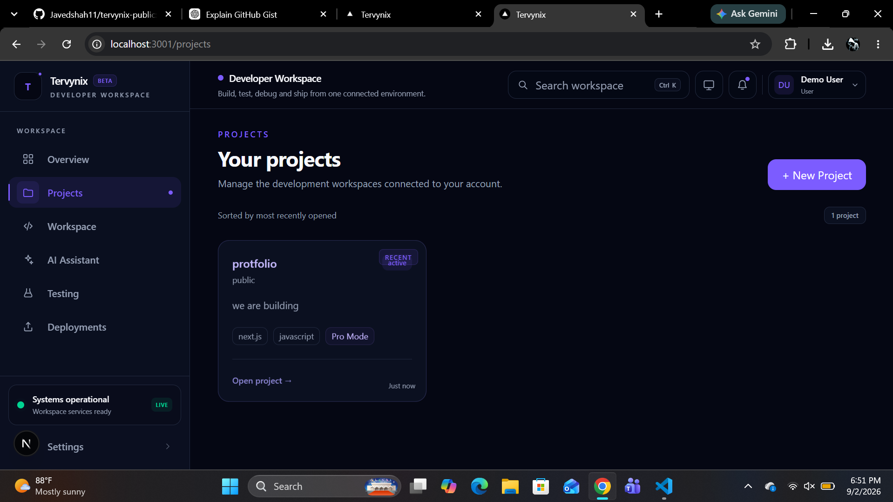
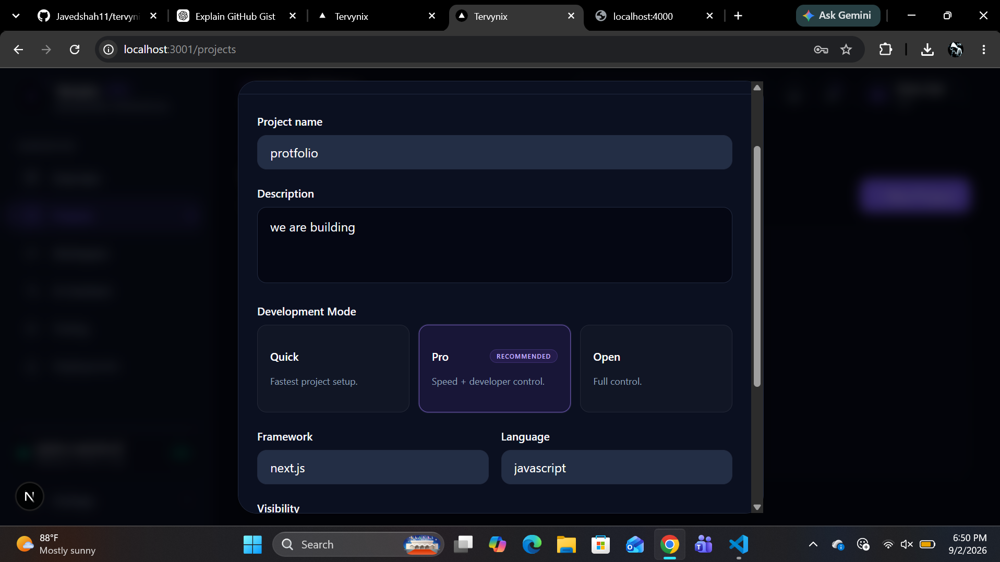

# Tervynix

> A modern developer workspace for coding, terminals, runtime management, AI-assisted development, and deployment.

<p align="center">
  <strong>Code • Run • Debug • Manage • Deploy</strong>
</p>

Tervynix is an actively developed developer platform focused on creating a powerful environment where developers can write code, run applications, manage processes, inspect ports, work with terminals, and eventually use intelligent development tools from one connected workspace.

---

## Product Preview

### Landing Experience


Tervynix presents a focused developer-first experience built around modern software engineering workflows.

---

### Developer Dashboard


The dashboard provides a central view of projects, AI sessions, testing, deployments, workspace state, and developer actions.

---

### Project Management



Create and manage development projects from one workspace while keeping project configuration and runtime context connected.

---

### Create Project



Tervynix supports structured project creation with development modes, frameworks, languages, visibility, and workspace configuration.

---

## Current Status

Tervynix is currently under active development.

### Available / Built

- Monaco-powered code workspace
- Project workspaces
- Multi-file tab management
- Autosave
- Integrated terminal
- Multiple terminal sessions
- Process management
- Port management
- Task discovery and execution
- Runtime monitoring
- Runtime history
- Authentication
- Project ownership protection
- Realtime runtime communication

### In Development

- NestJS + Fastify backend architecture
- PostgreSQL migration
- Drizzle ORM integration
- Realtime infrastructure
- Runtime reliability improvements
- Windows PTY reliability
- AI development capabilities
- Backend domain separation

### Planned

- Redis infrastructure
- BullMQ background processing
- Rust runtime agent
- Cloud development environments
- Workspace-aware AI assistant
- Deployment tooling
- Collaboration
- Developer APIs
- Extension ecosystem
- Observability and telemetry

---

## Developer Workspace

The long-term goal of Tervynix is to provide developers with one environment for the complete development workflow.

```text
Code
  ↓
Run
  ↓
Debug
  ↓
Manage
  ↓
Collaborate
  ↓
Deploy